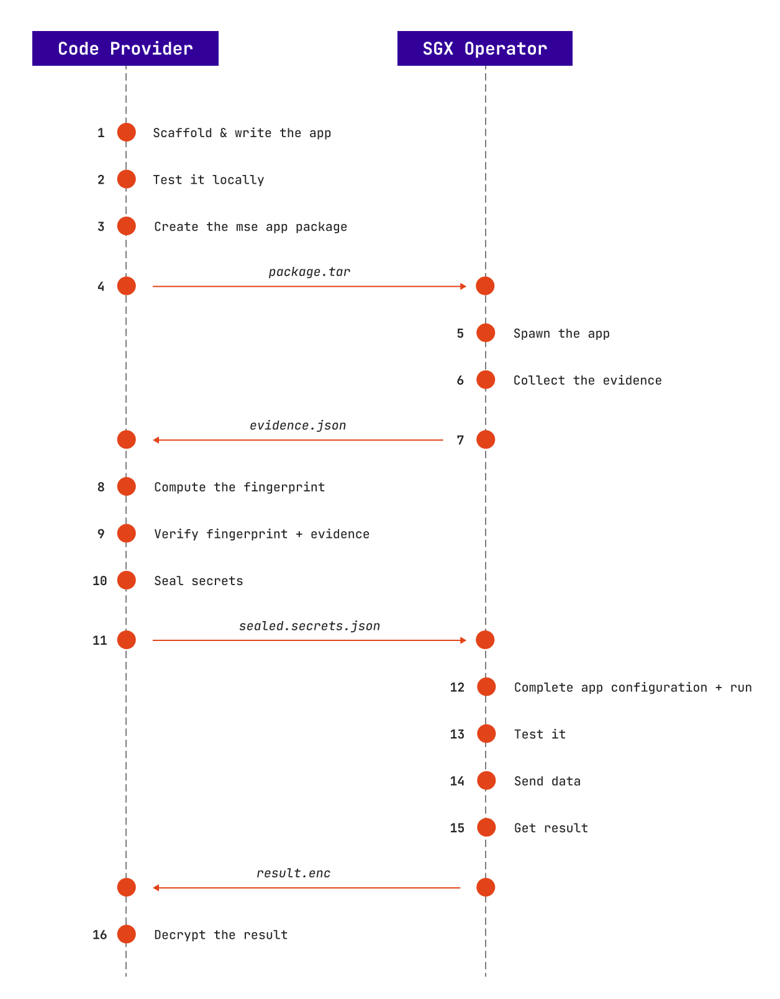

In the MSE Home usage scenario, two roles are defined:

- The code provider. This actor writes and owns the code of the microservice. It could also be the recipient of the result of this application.
- The SGX operator. This actor owns the SGX hardware which runs the code and the data to run against the MSE application.

MSE Home deals with several trust issues. No one needs to trust in anyone:

- The code provider can send the code in plaintext or encrypted to the SGX operator. Only the SGX enclave is able to decrypt and run it.
- The code provider can send secrets required by the code in plaintext or encrypted to the SGX operator. No one can alter the result before the code provider decrypts it.
- The result of the code can be generated in plaintext or encrypted and readable only by the code provider. Only the code provider could decrypt it.
- The code runs on the SGX technology so the memory is fully encrypted and the code integrity is verifiable at any time. No one can access the data, the result or the code during execution.

The following flow sums up the chained steps to deploy and run the code by being compliant with the previous privacy & security levels

